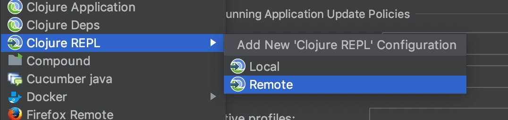
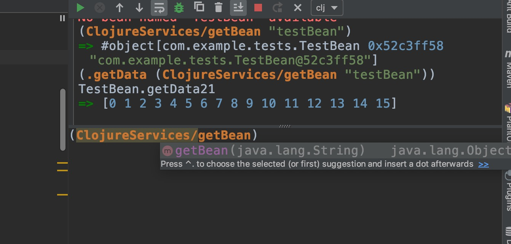

# clojure-nrepl-starter


### 这是什么?
这个是一个Spring-boot的nrepl快速启动组件,在Maven中引入该依赖后可以快速在Spring-boot项目中启动一个`Clojure-Cider-Nrepl`.

### 可以做什么?
启动`Nrepl`后可以在终端使用`lein connect`直接连接到该服务,连接后可以直接获取Spring上下文中的Bean,并且直接调用Bean的方法/查看当前属性状态
结合`Jrebel`可以实现JavaCode热加载并且Repl不断开,但是在终端里并没有代码补全,如果想体验补全的快感建议使用`Emacs+Cider`环境.

### 为啥出来了个这么个玩意
突发奇想,然后就被无聊的搞出来了

### 如何使用
直接在项目的`pom.xml`里引入依赖
```xml
<dependency>
  <groupId>com.github.matrixseven</groupId>
  <artifactId>clojure-nrepl-starter</artifactId>
  <version>1.0.0</version>
</dependency>
```
然后配置
```properties
#是否启动,默认不启动
clojure.nrepl.state=true
#服务绑定的端口,默认7888
clojure.nrepl.port=7888
#仅在以下环境中启动,默认为dev,优先级高于state
clojure.nrepl.mode=dev,test

```
### eg:
#### 直接emacs中启动nrepl链接


#### 或者直接在idea中添加远程repl


#### 然后尝试使用它.



## Enjoy it!